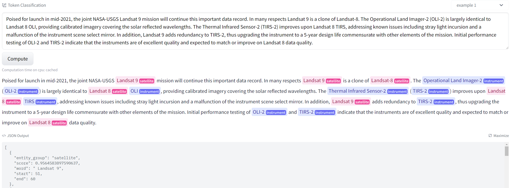

# Satellite-Instrument-NER
We introduce how to use the pre-trained language model and distant supervision to detect satellite and instrument entities in unstructured text.

The models currently available for download and online testing include:

[satellite-instrument-roberta-NER](https://huggingface.co/m-lin20/satellite-instrument-roberta-NER)

[satellite-instrument-bert-NER](https://huggingface.co/m-lin20/satellite-instrument-bert-NER)



## Citation

Our [paper](https://www.tandfonline.com/doi/full/10.1080/17538947.2022.2107098) has been published in the International Journal of Digital Earth :
```bibtex
@article{lin2022satellite,
  title={Satellite and instrument entity recognition using a pre-trained language model with distant supervision},
  author={Lin, Ming and Jin, Meng and Liu, Yufu and Bai, Yuqi},
  journal={International Journal of Digital Earth},
  volume={15},
  number={1},
  pages={1290--1304},
  year={2022},
  publisher={Taylor \& Francis}
}
```